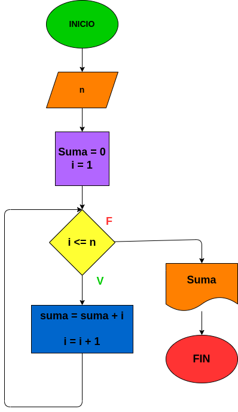

# Instrucciones_repetitibas
## Programa que sume los 10 primeros numeros naturales

# ANALISIS

Variables de entrada (input)

n = El numero que limita el bucle 

Variables de proceso (processing)

SUMA = 0

i = 1

Variables de salida (output)

suma = El resultado de la suma de los 10 primeros numeros naturales

# DISEÑO

# CONSTRUCCION
